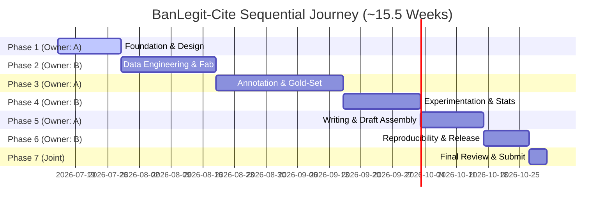

# BanLegit-Cite: Master Single-Owner Execution Plan
### Minimum-Coordination Architecture for Two Researchers (Ema & Zahid)

This plan governs the entire research journey from Day 1 to ICCIT submission. It enforces a strict **Single-Owner alternating phase structure** to minimize coordination costs and maximize speed.

---

## Governing Principles
1. **Single Ownership:** Each phase has exactly one human owner who makes all in-phase decisions and produces one exit deliverable package. The other researcher does not co-work or negotiate decisions mid-phase.
2. **Asynchronous Deep Work:** Coordination happens exclusively at fixed handoff gates through structured walk-throughs and PR reviews. No mid-phase sync meetings.
3. **Shadow Prep Work:** While the owner executes the active phase, the non-owner performs independent prep work that has zero content dependency on the active phase, avoiding idle time.
4. **Roles:** 
   - **Researcher A (Ema):** Judgment & Narrative Owner (owns Phase 1, Phase 3, Phase 5).
   - **Researcher B (Zahid):** Systems & Execution Owner (owns Phase 2, Phase 4, Phase 6).

---

## Complete Phase Map & Timeline

### Phase Details

#### Phase 1: Foundation & Research Design
- **Duration:** 2 Weeks (Weeks 1-2)
- **Owner:** Researcher A (Ema)
- **Objectives:** Lock RQ/H1-H3, dataset scope, novelty validation, and citation taxonomy v1.
- **Handoff Artifacts:** `data_scope.md`, `taxonomy_v1.md` + decision tree, `guideline_v1.md`, `novelty_report.md`, `gap_statement.md`, `rq_hypotheses.md`.
- **B's Shadow Work:** Scaffolding, DVC setup, Label Studio setup, scraper skeleton, `CLAUDE.md`.
- **Handoff Gate 1:** Ema runs a 45-60 min walkthrough for Zahid. B reviews for feasibility/clarity, not content authority. Merge to `main`.

#### Phase 2: Data Engineering & Fabrication Pipeline
- **Duration:** 3 Weeks (Weeks 3-5)
- **Owner:** Researcher B (Zahid)
- **Objectives:** Execute scraper/OCR pipeline, run LLM-assisted fabrication generation, and load all data into Label Studio.
- **Handoff Artifacts:** Loaded Label Studio project, `data_catalog.md` (metadata & copyright check), fabrication batch-approval logs.
- **A's Shadow Work:** Recruit annotators & senior adjudicator, finalize guidelines, run placeholder pilot round.
- **Joint Checkpoint:** Fabrication batch-review. B packages batches for one category at a time; A reviews in a single 1-2 hour session per category (5-6 total touchpoints).
- **Handoff Gate 2:** Zahid runs a 30-45 min walkthrough. A reviews and checks for content anomalies. Merge to `main`.

#### Phase 3: Annotation & Gold-Set Certification
- **Duration:** 4 Weeks (Weeks 6-9)
- **Owner:** Researcher A (Ema)
- **Objectives:** Execute double-annotation, compute agreement (κ), adjudicate disputes, and freeze the gold set (v1.0).
- **Handoff Artifacts:** Frozen `gold_dataset_v1.0/` (DVC-tracked), `iaa_report.md`, `adjudication_log.md`, stratified splits.
- **B's Shadow Work:** Build and unit-test baseline evaluation harness against synthetic placeholder data.
- **Handoff Gate 3:** Ema runs a 20-30 min walkthrough highlighting borderline agreement categories. Merge to `main`.

#### Phase 4: Experimentation & Statistical Validation
- **Duration:** 2.5 Weeks (Weeks 10-12)
- **Owner:** Researcher B (Zahid)
- **Objectives:** Execute standard and agentic baseline model runs, compute statistical significance (CIs and bootstrap p-values) for H1-H3, and extract error sample.
- **Handoff Artifacts:** `results_matrix.csv`, `stats_report.md`, `error_sample.json` (stratified 50 errors).
- **A's Shadow Work:** Draft Introduction, Related Work, Dataset, Taxonomy, and Annotation sections.
- **Handoff Gate 4:** Zahid runs a 30-45 min walkthrough explaining technical failure patterns. Merge to `main`.

#### Phase 5: Scientific Writing & Draft Assembly
- **Duration:** 2 Weeks (Weeks 12-14)
- **Owner:** Researcher A (Ema)
- **Objectives:** Assemble the complete first full draft (LaTeX source + PDF), integrate experiments, write error analysis narrative, and finalize tables/figures.
- **Handoff Artifacts:** Full draft PDF/LaTeX source, claim-to-artifact mapping.
- **B's Shadow Work:** Reproducibility prep, pinning library/model versions, verifying `RESULTS.md` links, copyright/licensing audits.
- **Handoff Gate 5:** Ema walkthrough of paper, flags technical descriptions to B for verification. Merge to `main`.

#### Phase 6: Reproducibility, Release & Reviewer Simulation
- **Duration:** 1.5 Weeks (Weeks 14-15)
- **Owner:** Researcher B (Zahid)
- **Objectives:** Complete the reproducibility dry-run, pack public release (GitHub + HuggingFace), get Zenodo DOI, and run final Reviewer Simulation (E2).
- **Handoff Artifacts:** Reproducibility verification log, public repo URLs, E2 review report.
- **A's Shadow Work:** Perform independent reproducibility test (A regenerates B's tables using B's documentation).
- **Joint Checkpoint:** E2 fatal-flaw resolution. Both Ema and Zahid must coordinate to fix critical reviewer flags.
- **Handoff Gate 6:** Zahid walkthrough of code release. Merge to `main`, tag `iccit-submission-v1`.

#### Phase 7: Final Joint Review & Submission
- **Duration:** 0.5 Weeks (Week 16)
- **Owner:** Joint
- **Objectives:** Run through the final submission checklist (Operating Manual Part 8), verify formatting, make the go/no-go call, and submit to ICCIT.

---

## Handoff Protocol (Mandatory Gate Actions)
1. **Declare:** Outgoing owner posts handoff package list in the research log.
2. **Review:** Incoming owner reviews artifacts asynchronously (minimum 24 hours).
3. **Walkthrough:** Sync walkthrough (time-boxed to 30-60 minutes) to address edge cases.
4. **Sign-off:** Incoming owner logs receipt with a dated entry in the decision log.
5. **Support:** Outgoing owner remains on-call (async quick questions only) for the first 2-3 days of the new phase.
