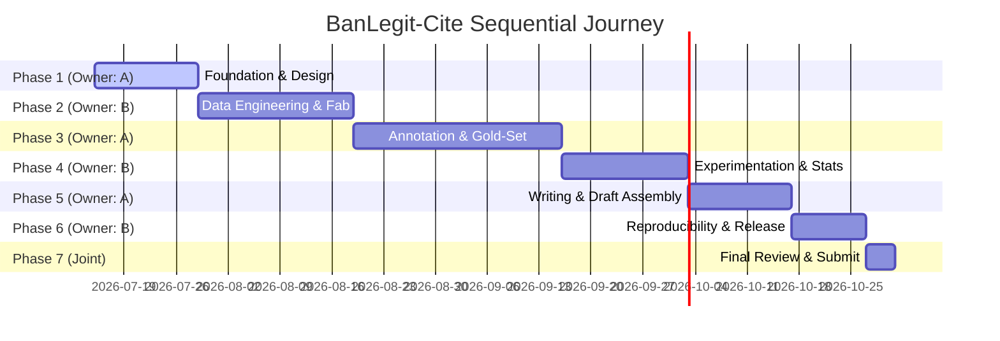

# Master Plan - Sequential Single-Owner Execution Plan (Researcher A Focus)

This document maps the entire research journey under the new **Sequential Single-Owner Execution Plan** (minimum-coordination architecture) for **Researcher A (Ema, Judgment & Narrative Owner)**. 

Ownership alternates between Ema (Phase 1, 3, 5) and Zahid (Phase 2, 4, 6) with Phase 7 being joint. The active owner makes all decisions within that phase, while the non-owner performs independent "shadow-work" or waits. 

---

## User Review Required

> [!IMPORTANT]
> **No Mid-Phase Decisions from Non-Owner:** Under this model, Ema has complete authority and accountability for Phase 1, Phase 3, and Phase 5. Zahid does not co-work or negotiate decisions mid-phase; he only reviews handoff packages for technical feasibility at gates.
> **Verification Responsibility:** In Phase 1, Ema must personally verify all competitor data, lock the scope of statutes/courts, and secure institutional access.
> **Handoff Gate Strictness:** Merging to `main` only occurs at handoff gates after a formal walkthrough and PR approval. No direct commits to `main` mid-phase.

---

## Open Questions

> [!IMPORTANT]
> **Q1:** For the Phase 1 shadow-work, is Zahid (Researcher B) already set up to initialize the repo scaffolding, DVC, W&B, and the `CLAUDE.md` instructions, or should Antigravity assist with creating templates for those?
> **Q2:** For the pilot annotation in Phase 1 (exit criteria for Taxonomy v1), do we have 1-2 law students recruited for the 20-instance test, or should we draft the taxonomy decision tree first?

---

## Proposed Changes

### Research Management Infrastructure

#### [NEW] [Master Single-Owner Execution Plan.md](file:///Users/shakera/Downloads/Study/Researches/ICCIT/BanLegit-Cite/Master%20Single-Owner%20Execution%20Plan.md)
- Create a permanent master markdown document in the workspace detailing all 7 phases, ownership, shadow-work, handoff deliverables, and exit gates.

#### [NEW] [decision_log.md](file:///Users/shakera/Downloads/Study/Researches/ICCIT/BanLegit-Cite/decision_log.md)
- Initialize the shared decision log. Only the active phase owner signs entries.

#### [NEW] [research_log.md](file:///Users/shakera/Downloads/Study/Researches/ICCIT/BanLegit-Cite/research_log.md)
- Initialize the daily research log to track agent run logs and human approvals.

---

### Phase 1: Foundation & Research Design (2 Weeks)
*Active Owner: Ema (Researcher A)*

Ema will execute the following steps using Antigravity as the primary reasoning/writing agent:

1. **Literature Map & Competitor Table:**
   - Use literature review agents (A2, A3) to construct `novelty_report.md` comparing the 6 core papers (LePhantomCite, LegalCiteBench, SG-LegalCite, LeCNet, BenHalluEval, Mina).
2. **Formulate RQ & Hypotheses (H1–H3):**
   - Refine the draft RQ/H1–H3 verifying statutory vs. precedent duality, script diglossia, and agentic validation gaps.
3. **Dataset Scope Lock:**
   - Create `data_scope.md` locking target Acts, courts, date ranges, and DLR/BLC/ALR access routes.
4. **Citation Taxonomy Design:**
   - Propose category boundaries (5 statutory sub-types, 5 precedent sub-types).
   - Run a 20-instance pilot annotation round (target κ ≥ 0.6) to freeze the taxonomy and draft guidelines.
5. **Handoff Gate 1:**
   - Compile the handoff package and run a 45-60 minute walkthrough for Zahid (B).

---

## Complete Research Journey Roadmap

### Summary of alternating phases:

| Phase | Duration | Owner | Deliverable Handoff Package | Non-Owner Shadow Work |
|---|---|---|---|---|
| **Phase 1: Foundation** | 2 wks | **A (Ema)** | `data-scope.md`, `taxonomy_v1.md`, `guideline_v1.md`, `novelty_report.md`, `gap_statement.md`, `rq_hypotheses.md` | **B (Zahid)**: Scaffolding, CI, DVC config, Label Studio setup, scraper skeleton, CLAUDE.md |
| **Phase 2: Data Eng** | 3 wks | **B (Zahid)** | Raw corpus (1.2k-1.5k), fabricated corpus, Label Studio load, copyright metadata | **A (Ema)**: Recruit annotators/adjudicator, finalize guidelines, run larger placeholder pilot |
| **Phase 3: Annotation** | 4 wks | **A (Ema)** | Gold dataset v1.0, IAA report (κ), adjudication log, stratified splits | **B (Zahid)**: Build/unit-test evaluation harness against synthetic/placeholder data |
| **Phase 4: Experiments**| 2.5 wks | **B (Zahid)** | Results matrix, significance test logs, stratified 50-error sample | **A (Ema)**: Draft Intro, Related Work, Dataset, Taxonomy, and Annotation sections |
| **Phase 5: Writing** | 2 wks | **A (Ema)** | Complete first full draft (LaTeX source + PDF), claim-to-artifact mapping | **B (Zahid)**: Pin library/model versions, verify RESULTS.md links, copyright review |
| **Phase 6: Release** | 1.5 wks | **B (Zahid)** | Successful dry-run log, HF/Zenodo release, E2 reviewer report | **A (Ema)**: Perform independent reproducibility dry-run of results from B's instructions |
| **Phase 7: Submit** | 0.5 wks | **Joint** | Submitted paper to ICCIT | Both review checklist, resolve fatal-flaw flags |

---

## Verification Plan

### Automated Verification
- Verify that `Master Single-Owner Execution Plan.md` is successfully created in the workspace.
- Ensure all markdown links inside the plan are valid and resolve correctly.

### Manual Verification
- A (Ema) verifies that Phase 1 deliverables (`novelty_report.md`, `gap_statement.md`, `rq_hypotheses.md`, `data_scope.md`, `taxonomy_v1.md`, `guideline_v1.md`) are properly initialized and ready for deep content development in the workspace.
