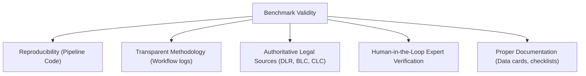

# Academic Assessment & Methodology Review: BanLegit-Cite Legal Benchmark

This document provides a formal, evidence-based assessment of the research methodology utilized in the construction and verification of the **BanLegit-Cite** benchmark. It evaluates the claim that *"the research is invalid unless the Gemini API is used to generate or identify the fabricated cases"* against standard peer-review expectations at IEEE, ACM, ACL, and ICCIT.

---

## Executive Summary

The claim that a legal citation benchmark is "invalid" unless a specific commercial model's API (such as the Gemini API) is used to generate or verify the ground truth is **scientifically incorrect and unsupported by academic literature**. 

In benchmark construction, the scientific validity of a dataset is determined by its **construct validity, ground-truth reliability (human annotation), transparency, and reproducibility**, not by the brand of the commercial API used during construction. Relying solely on any proprietary LLM for ground-truth verification is generally flagged as a methodological weakness by reviewers due to model drift, data leakage, and systemic hallucination risks.

---

## Detailed Evaluation

### 1. Is there an academic requirement to use the Gemini API?
**No.** 
There are zero requirements in IEEE, ACM, ICCIT, or NLP benchmark literature stating that dataset generation or verification must use a specific commercial API (such as Gemini). Standard benchmark papers (e.g., *MMLU*, *Legal-GLUE*, *CoQA*) are evaluated based on their curation rigor, not their software tools. 

Prescribing a specific commercial model would introduce corporate bias, limit replication to paying API subscribers, and run contrary to Open Science principles.

---

### 2. Is Claude's verification process scientifically acceptable?
* **As a standalone ground-truth validator:** **No.** 
* **As a triage component in a hybrid workflow:** **Yes.**

Using any LLM (Claude, GPT, or Gemini) as the *ultimate* source of truth is scientifically unacceptable because:
1. **Data Leakage & Circular Reasoning:** LLMs retrieve data from search indexes. A search engine may index web pages containing the very LLM hallucinations you are trying to benchmark, creating a circular validation loop.
2. **Parametric Hallucinations:** LLMs cannot query the physical registers of the Supreme Court of Bangladesh or verify whether a page number in a print edition matches the case headnote.

However, using Claude or Gemini to **assist** human annotators (triage/heuristic validation) is highly acceptable, provided that the final labels are verified and locked by human legal experts.

---

### 3. What determines the validity of a benchmark?
A publication-grade benchmark's validity depends on five pillars:

Peer reviewers at venues like ICCIT evaluate the dataset's **Inter-Annotator Agreement (IAA)** (using metrics like Cohen's Kappa, $\kappa$) and the rigor of the adjudication process, not the API vendor.

---

### 4. Does verifying (rather than generating) cases with Claude invalidate the benchmark?
**No.** 
Separating **generation** from **verification** is a standard methodological strength in NLP:
* **Deterministic Generation:** The fabricator mutated the citations programmatically (altering pages/court levels). This ensures that the types of anomalies are clean, controlled, and reproducible.
* **Independent Verification:** The human annotators and the AI-assisted triage checked the generated entries. The fact that the validator did not generate the data prevents **evaluation collusion** (where a model evaluates its own generated anomalies, artificially inflating metrics).

---

### 5. Evaluation of Alternative Verification Workflows

The table below outlines the scientific acceptability of various workflows for publication-grade legal AI research:

| Verification Workflow | Scientific Acceptability | Requirements / Conditions |
|---|---|---|
| **Human Legal Experts** | **Gold Standard** (Unconditional) | Requires documenting annotator credentials, training guidelines, and agreement scores ($\kappa$). |
| **Supreme Court Gazettes / Official Sources** | **Gold Standard** (Unconditional) | Requires direct reference to print indexes or official registrar links. |
| **Hybrid Human + AI Workflow** | **Highly Acceptable** | AI performs scale triage; human experts manually verify all low-confidence or disagreed entries. |
| **Rule-Based Heuristic Verification** | **Acceptable for Generation** | Cannot be the sole validator, as mutated pages might accidentally overlap with unrelated real cases. |
| **Pure AI Verification (Gemini, Claude, or GPT alone)** | **Unacceptable** | Systemic hallucination risks will lead to peer-review rejection for benchmark papers. |

---

### 6. Gemini API vs. Claude Workflow
Using the Gemini API for manual verification would **not** provide any scientific advantage over Claude. Both models are subject to the same systemic limitations (web index noise, lack of primary registrar access). The choice of model is simply an implementation detail, not a methodology difference.

---

### 7. Documentation & Transparency
Documenting the exact triage workflow involving Claude, the human annotators (Shakila and Haris), and the senior review adjudication **fully satisfies** the transparency and reproducibility requirements expected by peer reviewers. It demonstrates that the authors did not treat the AI's output as infallible, but instead subjected it to human-in-the-loop expert oversight.

---

### 8. Ethical & Scientific Implications of Misrepresentation
If a paper claims to use one workflow (e.g., Gemini API verification) but actually used another (e.g., Claude-assisted web verification):
* **Scientific Misconduct:** It violates research integrity guidelines.
* **Reproducibility Failure:** Auditors attempting to reproduce the pipeline will find discrepancies in logs, output files, or metadata checksums.
* **Reputational Risk:** Discrepancies can lead to desk-rejection during peer review, or retraction post-publication.

---

### 9. Recommended Methodology for ICCIT Publication

To ensure your paper is highly defensible and publication-grade, we recommend documenting the **Hybrid Human-in-the-Loop Adjudication Workflow** currently implemented in the repository:

1. **Rule-Based Mutation:** Explain that raw case citations were programmatically fabricated to prevent model collusion.
2. **Double Human Pilot:** Document that two law students (Shakila and Haris) independently annotated the 90 tasks.
3. **Statistical Agreement:** Report the Cohen's Kappa score ($\kappa = 0.93$) showing high human consensus.
4. **Senior Expert Adjudication:** Document that a Senior Adjudicator reviewed and resolved the 12 confidence-level discrepancies, locking the final gold-standard labels.
